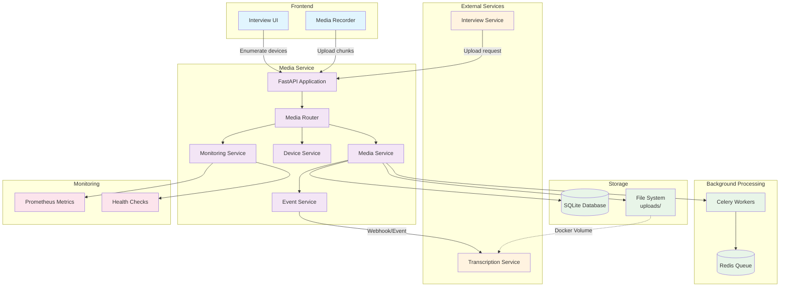

# TalentSync Media Service

## Overview

The TalentSync Media Service is a high-performance FastAPI-based microservice responsible for handling chunked audio/video uploads, device enumeration, and media file management for AI-powered interviews. It serves as the central hub for media processing in the TalentSync ecosystem.

## Architecture



## Features

### ✅ Core Functionality
- **Chunked Media Uploads**: Handles audio/video chunks with sequence management
- **Device Enumeration**: Lists available cameras and microphones
- **Session Management**: Tracks upload sessions with metadata
- **File Organization**: Structured storage with session-based directories
- **Gap Detection**: Identifies missing chunks in upload sequences
- **Event Emission**: Notifies other services of chunk uploads

### ✅ Performance & Reliability
- **Async/Await**: High-performance async operations
- **Background Processing**: Celery workers for heavy tasks
- **Monitoring**: Comprehensive health checks and metrics
- **Validation**: File type, size, and integrity validation
- **Error Handling**: Robust error handling with detailed logging

### ✅ Integration
- **Docker Support**: Containerized deployment
- **Shared Volumes**: File sharing with Transcription Service
- **API Documentation**: OpenAPI/Swagger documentation
- **Inter-Service Events**: HTTP webhooks and message queue events

## API Endpoints

### Media Management
- `POST /media/chunk-upload` - Upload media chunks
- `POST /media/session` - Create media session
- `GET /media/session/{session_id}/summary` - Get session summary
- `GET /media/session/{session_id}/gaps` - Check for missing chunks
- `DELETE /media/session/{session_id}` - Delete session and files

### Device Management
- `GET /media/devices` - Enumerate available devices
- `GET /media/devices/cameras` - List cameras only
- `GET /media/devices/microphones` - List microphones only

### Monitoring & Utilities
- `GET /health` - Health check
- `GET /metrics` - System metrics
- `GET /prometheus` - Prometheus metrics
- `GET /media/storage/stats` - Storage statistics
- `POST /media/validate-file` - Validate file format

## Database Schema

### MediaSession
```sql
CREATE TABLE media_sessions (
    id INTEGER PRIMARY KEY,
    session_id VARCHAR(255) UNIQUE NOT NULL,
    interview_id VARCHAR(255),
    user_id VARCHAR(255),
    total_chunks INTEGER DEFAULT 0,
    total_duration_seconds FLOAT DEFAULT 0.0,
    session_status VARCHAR(50) DEFAULT 'active',
    created_at DATETIME DEFAULT CURRENT_TIMESTAMP,
    updated_at DATETIME DEFAULT CURRENT_TIMESTAMP,
    completed_at DATETIME,
    extra_data TEXT
);
```

### MediaChunk
```sql
CREATE TABLE media_chunks (
    id INTEGER PRIMARY KEY,
    session_id VARCHAR(255) NOT NULL,
    question_id VARCHAR(255),
    sequence_index INTEGER NOT NULL,
    overlap_seconds FLOAT DEFAULT 2.0,
    file_path VARCHAR(500) NOT NULL,
    file_name VARCHAR(255) NOT NULL,
    file_size_bytes INTEGER,
    file_extension VARCHAR(10),
    duration_seconds FLOAT,
    upload_status VARCHAR(50) DEFAULT 'pending',
    transcription_status VARCHAR(50) DEFAULT 'pending',
    uploaded_at DATETIME DEFAULT CURRENT_TIMESTAMP,
    processed_at DATETIME,
    is_valid BOOLEAN DEFAULT TRUE,
    validation_errors TEXT
);
```

## Configuration

### Environment Variables
```env
# Application Settings
APP_NAME=TalentSync Media Service
DEBUG=false
ENVIRONMENT=production

# Server Configuration
HOST=0.0.0.0
PORT=8005
WORKERS=4

# Database
DATABASE_URL=sqlite+aiosqlite:///./media_service.db

# File Storage
UPLOAD_DIR=./uploads
MAX_FILE_SIZE=104857600
ALLOWED_EXTENSIONS_STR=webm,mp3,wav,m4a,ogg

# Redis/Celery
REDIS_URL=redis://localhost:6379/0
CELERY_BROKER_URL=redis://localhost:6379/0

# Integration
TRANSCRIPTION_SERVICE_URL=http://transcription-service:8002
INTERVIEW_SERVICE_URL=http://interview-service:8001
```

## Installation & Setup

### Using Docker (Recommended)
```bash
# Build the container
docker build -t media-service .

# Run with docker-compose
docker-compose up media-service
```

### Local Development
```bash
# Install dependencies
pip install -r requirements.txt

# Set up environment
cp .env.example .env

# Initialize database
python -c "from app.core.database import init_db; import asyncio; asyncio.run(init_db())"

# Start the service
uvicorn app.main:app --host 0.0.0.0 --port 8003 --reload

# Start Celery worker (separate terminal)
celery -A app.workers.celery_app worker --loglevel=info

# Start Celery beat (separate terminal)
celery -A app.workers.celery_app beat --loglevel=info
```

## Usage Examples

### Upload a Chunk
```python
import requests

# Upload chunk
files = {'file': ('chunk_0.webm', audio_data, 'audio/webm')}
data = {
    'session_id': 'interview_123',
    'sequence_index': 0,
    'total_chunks': 5,
    'overlap_seconds': 2.0
}

response = requests.post(
    'http://localhost:8003/media/chunk-upload',
    files=files,
    data=data
)
```

### Get Session Summary
```python
response = requests.get(
    'http://localhost:8003/media/session/interview_123/summary'
)
session_info = response.json()
```

### Enumerate Devices
```python
response = requests.get('http://localhost:8003/media/devices')
devices = response.json()
print(f"Cameras: {devices['cameras']}")
print(f"Microphones: {devices['microphones']}")
```

## Monitoring

### Health Check
```bash
curl http://localhost:8003/health
```

### Metrics
```bash
# JSON metrics
curl http://localhost:8003/metrics

# Prometheus format
curl http://localhost:8003/prometheus
```

### Key Metrics
- `media_chunk_uploads_total` - Total chunk uploads
- `media_active_sessions` - Active upload sessions
- `media_storage_usage_bytes` - Storage utilization
- `media_processing_queue_size` - Background queue size

## File Organization

```
uploads/
├── session_001/
│   ├── chunk_0000.webm
│   ├── chunk_0001.webm
│   └── chunk_0002.webm
├── session_002/
│   ├── chunk_0000.webm
│   └── chunk_0001.webm
└── ...
```

## Inter-Service Communication

### Event Emission
When chunks are uploaded, the service emits events to notify other services:

```json
{
  "event_type": "chunk_uploaded",
  "session_id": "interview_123",
  "chunk_id": 42,
  "sequence_index": 0,
  "file_path": "/uploads/interview_123/chunk_0000.webm",
  "timestamp": "2025-07-08T10:00:00Z"
}
```

### Integration Points
- **Interview Service**: Calls chunk upload when recorder stops
- **Transcription Service**: Receives events and processes audio files
- **Shared Volume**: Files accessible to Transcription Service via Docker volume

## Background Tasks

### Celery Workers
- **Chunk Processing**: Metadata extraction and validation
- **File Cleanup**: Periodic cleanup of old files
- **Gap Detection**: Monitor for missing chunks
- **Health Monitoring**: System health checks

### Task Queues
- `media_processing` - Chunk processing tasks
- `media_validation` - File validation tasks
- `media_cleanup` - Cleanup operations
- `media_monitoring` - Monitoring tasks

## Error Handling

### Common Error Codes
- `400` - Invalid file format or size
- `404` - Session or chunk not found
- `413` - File too large
- `422` - Validation error
- `500` - Internal server error

### Error Response Format
```json
{
  "error": "ValidationError",
  "message": "File size exceeds maximum allowed",
  "details": [
    {
      "type": "file_size",
      "message": "File size 150MB exceeds limit of 100MB",
      "field": "file"
    }
  ],
  "timestamp": "2025-07-08T10:00:00Z"
}
```

## Security

### File Validation
- File size limits (configurable)
- Allowed extensions whitelist
- Content type validation
- File integrity checks

### Access Control
- Session-based access control
- Input sanitization
- SQL injection prevention
- Path traversal protection

## Performance

### Optimizations
- Async file I/O with aiofiles
- Database connection pooling
- Background processing with Celery
- Prometheus metrics for monitoring

### Scaling
- Horizontal scaling with multiple workers
- Redis for distributed task queues
- Shared storage for multi-instance deployments
- Load balancing ready

## Development

### Project Structure
```
app/
├── core/           # Core configuration and database
├── models/         # SQLAlchemy models
├── schemas/        # Pydantic schemas
├── routers/        # FastAPI route handlers
├── services/       # Business logic services
└── workers/        # Celery background tasks
```

### Code Quality
- Type hints throughout
- Pydantic validation
- Comprehensive error handling
- Structured logging
- Unit and integration tests

## Testing

See `tests/` directory for comprehensive test suites:
- Unit tests for services and models
- Integration tests for API endpoints
- End-to-end workflow tests
- Performance benchmarks

## Deployment

### Docker
```dockerfile
FROM python:3.11-slim
WORKDIR /app
COPY requirements.txt .
RUN pip install -r requirements.txt
COPY . .
EXPOSE 8003
CMD ["uvicorn", "app.main:app", "--host", "0.0.0.0", "--port", "8003"]
```

### Docker Compose
```yaml
services:
  media-service:
    build: .
    ports:
      - "8003:8003"
    volumes:
      - uploads:/app/uploads
    environment:
      - DATABASE_URL=sqlite+aiosqlite:///./media_service.db
    depends_on:
      - redis
```

## Contributing

1. Fork the repository
2. Create a feature branch
3. Write tests for your changes
4. Ensure all tests pass
5. Submit a pull request

## License

Copyright (c) 2025 TalentSync. All rights reserved.

---

**Status**: ✅ Production Ready  
**Version**: 1.0.0  
**Last Updated**: July 8, 2025
