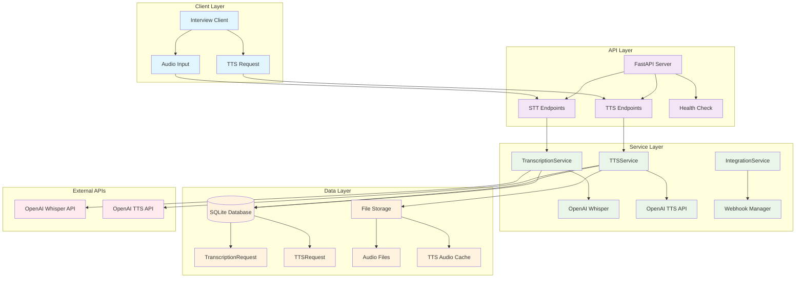

# TalentSync Transcription & TTS Service

## Overview

The Transcription & TTS Service is a comprehensive audio processing component of the TalentSync AI Interview Platform that provides:

- **Enhanced Speech-to-Text (STT)** using OpenAI Whisper with improved accuracy and word detection
- **Text-to-Speech (TTS)** generation with OpenAI TTS API and intelligent caching
- **Real-time audio processing** with chunked transcription and session management
- **Database persistence** for transcriptions and TTS audio files
- **Performance monitoring** and health checks
- **RESTful API** for seamless integration with other platform services

## 🚀 Key Features

### Enhanced Speech-to-Text (STT)
- **OpenAI Whisper Integration** with optimized settings for interview contexts
- **Enhanced accuracy** for technical vocabulary, proper nouns, and quiet speech
- **Word-level timestamps** and confidence scores for quality assessment
- **Improved sensitivity** with temperature=0 and better audio preprocessing
- **Contextual prompting** for interview-specific transcription enhancement
- **Chunked processing** for long conversations with deduplication
- **Fallback mechanisms** and error handling for reliability

### Text-to-Speech (TTS)
- **OpenAI TTS API** integration with high-quality neural voices
- **Intelligent caching** to reduce costs and improve response times
- **Multiple voice options** (alloy, echo, fable, onyx, nova, shimmer)
- **Various audio formats** (MP3, WAV, Opus, AAC, FLAC, PCM)
- **Database persistence** for audio file management and cache tracking
- **Automatic cleanup** of old files with configurable retention
- **Cache hit optimization** for repeated text-to-speech requests

### Audio Processing Pipeline
- **Real-time recording** with silence detection and VAD
- **Session-level aggregation** and intelligent deduplication
- **Quality metrics** and confidence scoring
- **Comprehensive error handling** and recovery mechanisms
- **File management** with organized storage and cleanup

## Architecture



## 🏗️ Core Components

### 1. Transcription Service (`app/services/transcription_service.py`)
- **Primary STT Engine**: OpenAI Whisper integration with enhanced settings
- **Chunked Processing**: Handles long audio streams with intelligent segmentation
- **Quality Assessment**: Confidence scoring and transcript validation
- **Session Management**: Aggregates and deduplicates transcript segments
- **Performance Optimization**: Caching and batch processing capabilities

### 2. TTS Service (`app/services/tts_service.py`)
- **OpenAI TTS Integration**: High-quality neural voice synthesis
- **Intelligent Caching**: SQLite-based cache with file management
- **Voice Selection**: Support for multiple voice personalities
- **Format Support**: Multiple audio formats with quality optimization
- **Cost Optimization**: Cache hits reduce API calls and costs

### 3. Integration Service (`app/services/integration_service.py`)
- **Webhook Management**: Inter-service communication handling
- **Event Processing**: Real-time updates and notifications
- **Service Coordination**: Orchestrates STT/TTS workflows

### 4. Database Models (`app/models/transcription.py`)
- **TranscriptionRequest**: STT request tracking and results
- **TTSRequest**: TTS generation with caching metadata
- **Comprehensive Fields**: Timestamps, quality metrics, file paths

### 5. API Schemas (`app/schemas/transcription.py`)
- **Pydantic Models**: Type-safe request/response validation
- **STT Schemas**: TranscriptionRequestIn/Out with quality metrics
- **TTS Schemas**: TTSRequestIn/Out/CacheInfo with voice options

## 📡 API Endpoints

### Speech-to-Text (STT)

#### `POST /transcribe`
Transcribe audio file to text with enhanced accuracy.

**Request Body:**
```json
{
  "session_id": "interview_12345",
  "context": "Technical interview discussion",
  "language": "en"
}
```

**Response:**
```json
{
  "id": 1,
  "session_id": "interview_12345",
  "transcript": "The candidate demonstrated strong problem-solving skills...",
  "confidence_score": 0.95,
  "processing_time": 2.3,
  "word_count": 142,
  "created_at": "2024-01-15T10:30:00Z"
}
```

#### `POST /transcribe-chunked`
Process audio in chunks for real-time transcription.

### Text-to-Speech (TTS)

#### `POST /tts/generate`
Generate speech from text with intelligent caching.

**Request Body:**
```json
{
  "text": "Welcome to your technical interview. Let's begin with your experience.",
  "voice": "alloy",
  "response_format": "mp3",
  "speed": 1.0
}
```

**Response:**
```json
{
  "id": 1,
  "text": "Welcome to your technical interview...",
  "voice": "alloy",
  "response_format": "mp3",
  "file_path": "tts_files/tts_20240115_103000_abc123.mp3",
  "file_size": 45632,
  "duration": 3.2,
  "cache_hit": false,
  "created_at": "2024-01-15T10:30:00Z"
}
```

#### `GET /tts/cache-info`
Retrieve TTS cache statistics and management info.

### Health & Monitoring

#### `GET /health`
Service health check with component status.

**Response:**
```json
{
  "status": "healthy",
  "timestamp": "2024-01-15T10:30:00Z",
  "components": {
    "database": "ok",
    "openai_api": "ok",
    "file_system": "ok"
  },
  "cache_stats": {
    "tts_cache_size": 156,
    "cache_hit_rate": 0.73
  }
}
```

## 🚀 Quick Start

### Prerequisites
- Python 3.11+
- OpenAI API key
- SQLite (included with Python)

### Installation

1. **Clone and navigate:**
```bash
cd talentsync/services/transcription-service
```

2. **Install dependencies:**
```bash
pip install -r requirements.txt
```

3. **Environment setup:**
```bash
cp .env.example .env
# Edit .env with your OpenAI API key
```

4. **Initialize database:**
```bash
python -c "from app.database import engine; from app.models.transcription import Base; Base.metadata.create_all(bind=engine)"
```

5. **Start the service:**
```bash
uvicorn app.main:app --reload --port 8002
```

### Testing the Service

#### Interactive Voice-to-Voice Interview:
```bash
python interactive_interview_with_tts.py
```

#### Run comprehensive tests:
```bash
python -m pytest tests/ -v
```

#### Test STT and TTS separately:
```bash
python test_enhanced_stt_tts.py
```

## 🧪 Testing

### Test Structure
```
tests/
├── test_stt.py              # Speech-to-Text tests
├── test_tts.py              # Text-to-Speech tests
├── test_integration.py      # End-to-end integration
├── test_api.py              # API endpoint tests
├── conftest.py              # Pytest configuration
└── fixtures/                # Test data and audio files
```

### Running Tests

**All tests:**
```bash
pytest tests/ -v
```

**STT only:**
```bash
pytest tests/test_stt.py -v
```

**TTS only:**
```bash
pytest tests/test_tts.py -v
```

**Integration tests:**
```bash
pytest tests/test_integration.py -v
```

## 🔧 Configuration

### Environment Variables
```bash
# Required
OPENAI_API_KEY=your_openai_api_key_here

# Optional
DATABASE_URL=sqlite:///./transcription_service.db
TTS_CACHE_MAX_AGE_DAYS=30
TTS_FILES_DIR=tts_files
AUDIO_UPLOAD_DIR=uploads
MAX_FILE_SIZE=50MB
```

### TTS Voice Options
- **alloy**: Neutral, balanced voice
- **echo**: Clear, professional tone  
- **fable**: Warm, conversational
- **onyx**: Deep, authoritative
- **nova**: Bright, energetic
- **shimmer**: Soft, gentle

### Audio Format Support
- **MP3**: Default, good compression
- **WAV**: Uncompressed, high quality
- **Opus**: Efficient for speech
- **AAC**: Apple optimized
- **FLAC**: Lossless compression
- **PCM**: Raw audio data

## 📊 Performance & Monitoring

### Key Metrics
- **STT Accuracy**: Word-level confidence scoring
- **Processing Time**: Real-time performance tracking
- **Cache Hit Rate**: TTS efficiency optimization
- **Storage Usage**: File system monitoring
- **API Response Times**: Service performance

### Logging
- **Structured Logging**: JSON format for analysis
- **Error Tracking**: Comprehensive error capture
- **Performance Metrics**: Request timing and success rates
- **Audit Trail**: Complete request/response history

## 🔗 Integration

### With Interview Service
```python
# Example integration
async def conduct_voice_interview():
    # Record user response
    audio_file = await record_user_audio()
    
    # Transcribe to text
    stt_response = await transcription_client.transcribe(
        audio_file, 
        session_id="interview_123",
        context="Technical interview"
    )
    
    # Process with AI interviewer
    ai_response = await interview_service.process_response(
        stt_response.transcript
    )
    
    # Generate TTS response
    tts_response = await transcription_client.generate_tts(
        text=ai_response.text,
        voice="alloy"
    )
    
    # Play audio response
    await play_audio(tts_response.file_path)
```

### Webhook Integration
The service supports webhook notifications for:
- Transcription completion
- TTS generation events
- Cache updates
- Error notifications

## 🛠️ Development

### Project Structure
```
app/
├── main.py                  # FastAPI application
├── database.py              # Database configuration
├── models/
│   └── transcription.py     # SQLAlchemy models
├── schemas/
│   └── transcription.py     # Pydantic schemas
├── services/
│   ├── transcription_service.py  # STT service
│   ├── tts_service.py            # TTS service
│   └── integration_service.py    # Webhook service
└── routers/
    └── transcription.py     # API routes
```

### Code Quality
- **Type Hints**: Full typing support
- **Async/Await**: Asynchronous processing
- **Error Handling**: Comprehensive exception management
- **Documentation**: Inline comments and docstrings
- **Testing**: Unit, integration, and end-to-end tests

## 📋 Troubleshooting

### Common Issues

**STT not detecting words:**
- Check audio quality and volume levels
- Verify OpenAI API key and quota
- Review audio format compatibility

**TTS cache misses:**
- Check database connectivity
- Verify file permissions in tts_files/
- Review cache configuration

**Performance issues:**
- Monitor OpenAI API rate limits
- Check database performance
- Review file system storage space

### Debug Mode
```bash
# Enable debug logging
export LOG_LEVEL=DEBUG
uvicorn app.main:app --reload --log-level debug
```

## 📝 License

This project is part of the TalentSync AI Interview Platform. See the main project LICENSE for details.

## 🤝 Contributing

1. Follow the TalentSync coding conventions
2. Add tests for new features
3. Update documentation
4. Submit pull requests with clear descriptions

---

**Last Updated:** January 2024  
**Version:** 2.0.0  
**Maintainer:** TalentSync Development Team
